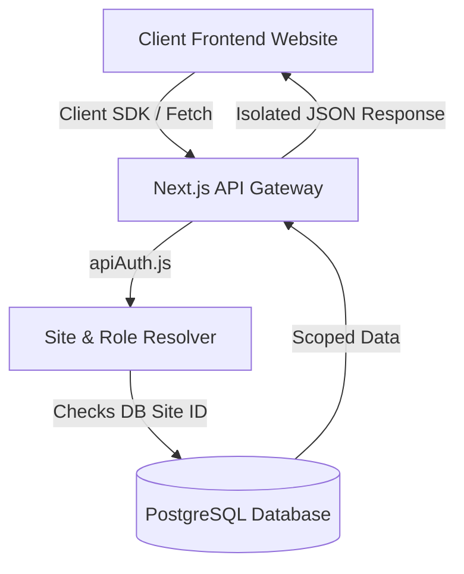

# New Website Integration Guide - Global Backend CMS

This guide walks you through the step-by-step process of integrating a new website (tenant) with the Global Backend CMS. Because this system is built as a multi-tenant headless CMS, you can connect any frontend framework (Next.js, React, Vue, Svelte, or vanilla JS) to it by specifying a unique `siteId`.

---

## Architecture Overview



Every database table is scoped by a `siteId` attribute. All REST API requests require a matching site identifier passed via either:
1. An `x-site-id` custom HTTP Header.
2. A `siteId` URL Query Parameter.

---

## Step 1: Create and Register the Site ID

Before your frontend can interact with the backend, you must register the new website in the global backend database.

### 1. Insert a Site Record
Connect to your PostgreSQL database (using Prisma or any database client) and create a new row in the `Site` table:

```sql
INSERT INTO "Site" (id, name, domain, "createdAt", "updatedAt")
VALUES (
  'site_alpha_123', 
  'Alpha Company Website', 
  'https://alpha.example.com', 
  NOW(), 
  NOW()
);
```

Or via Prisma:
```javascript
const newSite = await prisma.site.create({
  data: {
    id: 'site_alpha_123',
    name: 'Alpha Company Website',
    domain: 'https://alpha.example.com',
  }
});
```

### 2. Map Users and Roles (For Admin Panel Access)
To allow editors or admin users to log in and manage this site in the Admin Dashboard, map users to this site using the `SiteUser` table:

```sql
-- Map existing user to the new site as ADMIN
INSERT INTO "SiteUser" ("userId", "siteId", "role", "createdAt", "updatedAt")
VALUES (
  'usr_admin_uuid', 
  'site_alpha_123', 
  'ADMIN', 
  NOW(), 
  NOW()
);
```

Available roles: `SUPERADMIN`, `ADMIN`, `EDITOR`, `VIEWER`.

---

## Step 2: Configure CORS and Client Environments

### 1. Allowed Frontend Origins
By default, the backend middleware validates request origins. Ensure your frontend domain is added to the backend's environment variables or site configuration to allow CORS requests.

### 2. Client Environment Variables
On your frontend project, add the following to your `.env` or `.env.local` file:

```env
# The endpoint URL of the deployed Global Backend CMS
NEXT_PUBLIC_CMS_BASE_URL=https://cms-api.yourdomain.com

# The registered Site ID for this tenant
NEXT_PUBLIC_SITE_ID=site_alpha_123
```

---

## Step 3: Install and Initialize the Javascript SDK Client

You can find the lightweight client SDK wrapper at `src/sdk/index.js`. Copy this file into your frontend directory (e.g. `lib/cms-sdk.js` or install it as a private dependency).

### Initialization
Create an SDK instance in your project:

```javascript
import { CMSClient } from './cms-sdk';

export const cms = new CMSClient({
  baseUrl: process.env.NEXT_PUBLIC_CMS_BASE_URL,
  siteId: process.env.NEXT_PUBLIC_SITE_ID
});
```

---

## Step 4: Loading Global Configurations (Layout Level)

In your root layout or main layout component, load the website settings, navigation menus, and header/footer configurations.

```javascript
import { cms } from '@/lib/cms';

export async function generateMetadata() {
  const { data: settings } = await cms.getSettings();
  const { data: seo } = await cms.getSeoMetadata('/'); // SEO for home page
  
  return {
    title: seo?.title || settings?.websiteSettings?.title || 'Default Title',
    description: seo?.description || settings?.websiteSettings?.description,
    icons: {
      icon: settings?.websiteSettings?.favicon || '/favicon.ico',
    }
  };
}

export default async function RootLayout({ children }) {
  // Parallel fetch configuration for layout
  const [navData, headerData, footerData] = await Promise.all([
    cms.getNavigation('main'),
    cms.getHeaderLayout(),
    cms.getFooterLayout()
  ]);

  return (
    <html lang="en">
      <body>
        <Header navigation={navData?.data} layout={headerData?.data} />
        <main>{children}</main>
        <Footer layout={footerData?.data} />
      </body>
    </html>
  );
}
```

---

## Step 5: Loading Page Content and Collection Lists

### 1. Dynamic Page Sections
Fetch the sections config for a specific page slug:

```javascript
const { data } = await cms.getPage('/about');
const sections = data?.sections || [];

return (
  <div>
    {sections.map(section => {
      switch (section.type) {
        case 'HERO':
          return <HeroSection key={section.id} content={section.content} />;
        case 'FEATURES':
          return <FeaturesSection key={section.id} content={section.content} />;
        default:
          return null;
      }
    })}
  </div>
);
```

### 2. FAQ Accordion & Schema Markup
Retrieve FAQs for a page and render JSON-LD schema for SEO:

```javascript
const faqResponse = await cms.getFaqs('/pricing');
const faqs = faqResponse?.faqs || [];

const faqSchema = {
  "@context": "https://schema.org",
  "@type": "FAQPage",
  "mainEntity": faqs.map(faq => ({
    "@type": "Question",
    "name": faq.question,
    "acceptedAnswer": {
      "@type": "Answer",
      "text": faq.answer
    }
  }))
};
```

---

## Step 6: Form Submissions and Leads Management

When users fill out forms, submit them directly using the SDK to trigger database registration, admin notifications, and auto-replies.

```javascript
import { cms } from '@/lib/cms';
import { useState } from 'react';

export default function ContactForm() {
  const [formData, setFormData] = useState({ name: '', email: '', phone: '', message: '' });
  const [status, setStatus] = useState(null);

  const handleSubmit = async (e) => {
    e.preventDefault();
    try {
      const response = await cms.submitContactForm(formData);
      if (response.success) {
        setStatus({ type: 'success', text: 'Thank you! We will get in touch shortly.' });
        setFormData({ name: '', email: '', phone: '', message: '' });
      }
    } catch (err) {
      setStatus({ type: 'error', text: err.message || 'Submission failed.' });
    }
  };

  return (
    <form onSubmit={handleSubmit}>
      {/* Inputs mapped to formData */}
      <button type="submit">Submit Form</button>
      {status && <div className={status.type}>{status.text}</div>}
    </form>
  );
}
```

---

## Step 7: Visitor Analytics and GDPR Compliance

### 1. Live Visitor Session Tracking
Add the tracking hook to the layout of your frontend to ping the live traffic dashboard:

```javascript
import { useEffect } from 'react';
import { cms } from '@/lib/cms';

export function useVisitorTracker() {
  useEffect(() => {
    // Generate or fetch a visitor cookie token
    let visitorId = localStorage.getItem('visitor_id');
    if (!visitorId) {
      visitorId = `vis_${Math.random().toString(36).substring(2, 15)}`;
      localStorage.setItem('visitor_id', visitorId);
    }

    // Ping the backend every 60 seconds
    const ping = () => {
      cms.pingVisitor({
        visitorId,
        pageViewed: window.location.pathname,
        deviceInfo: navigator.userAgent,
        trafficSource: document.referrer || 'Direct'
      }).catch(err => console.error('Traffic ping failed', err));
    };

    ping();
    const interval = setInterval(ping, 60000);
    return () => clearInterval(interval);
  }, []);
}
```

### 2. GDPR Consent Logging
Log user cookie preference responses dynamically:

```javascript
const handleConsent = async (accepted) => {
  await cms.recordConsent({
    visitorId: localStorage.getItem('visitor_id'),
    consentType: 'cookies',
    accepted
  });
};
```

---

## Step 8: Security and reCAPTCHA Verification

To protect endpoints like `/api/forms/submit` from spam bots:
1. Enable reCAPTCHA in settings via the Admin panel.
2. In the client, load the Google reCAPTCHA script.
3. Pass the resolved token under the body parameter:

```javascript
const response = await fetch(`${baseUrl}/api/forms/submit`, {
  method: 'POST',
  headers: { 'x-site-id': 'site_alpha_123', 'Content-Type': 'application/json' },
  body: JSON.stringify({
    ...formData,
    recaptchaToken: 'g_recaptcha_token_from_client_execution'
  })
});
```

---

## Troubleshooting & Best Practices

> [!TIP]
> **Performance Optimization:** Enable page lazy loading configurations in `cms.getSettings()` -> `performanceConfig`. Utilize caching on heavy read operations (such as Blog and FAQs) to minimize API latency.

> [!IMPORTANT]
> **Data Security & Isolation:** Always double-check that your client sets the `x-site-id` header correctly. Failure to supply this header will result in a `400 Bad Request` or an empty resource array.

> [!WARNING]
> **Production Domain CORS Restrictions:** Ensure your client frontend domains match the allowed cors configuration domains inside the tenant's `GlobalSettings` (`securityControls`) configuration object.
